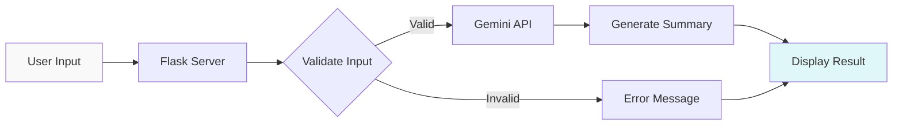

# 📝 AI Text Summarization App

<div align="center">


**Intelligent text summarization powered by Google's Gemini AI - Transform long texts into concise summaries instantly**

[Features](#-features) • [Installation](#-installation) • [Usage](#-usage) • [Demo](#-demo) • [API](#-how-it-works)

</div>

---

## 📖 Overview

AI Text Summarization is a web-based application that uses **Google's Gemini 2.0 Flash** model to automatically generate concise, accurate summaries from long texts. Perfect for students, researchers, professionals, and anyone who needs to quickly understand large volumes of text.

### 🎯 Key Highlights

- **Instant Summarization**: Generate summaries in seconds
- **Powered by Gemini AI**: Latest Google AI technology
- **Clean Web Interface**: Simple, intuitive design
- **No Length Limits**: Summarize texts of any length
- **Error Handling**: Robust validation and error messages
- **Beautiful UI**: Modern gradient design with smooth UX
- **Free to Use**: Open-source and customizable

---

## ✨ Features

### 🤖 **AI-Powered Summarization**
- **Google Gemini 2.0 Flash**: State-of-the-art language model
- **Intelligent Extraction**: Identifies key points automatically
- **Context Preservation**: Maintains original meaning
- **Multi-language Support**: Works with various languages
- **Fast Processing**: Responses in 1-3 seconds

### 🎨 **User Interface**
- **Clean Design**: Teal/cyan gradient theme
- **Responsive Layout**: Works on desktop, tablet, mobile
- **Cairo Font**: Beautiful Arabic/multilingual font support
- **Input Preservation**: Keeps original text visible
- **Real-time Feedback**: Instant error messages

### 🔒 **Input Validation**
- **Empty Check**: Prevents blank submissions
- **Whitespace Handling**: Trims unnecessary spaces
- **Error Messages**: Clear, helpful feedback
- **Safe Processing**: Exception handling

### 💡 **Use Cases**
- **Academic**: Research papers, articles, books
- **Business**: Reports, emails, documents
- **News**: Articles, blogs, press releases
- **Legal**: Contracts, agreements, terms
- **Personal**: Long emails, messages, notes

---

## 🏗️ Architecture

### System Flow



### Application Structure

```
┌─────────────────────────────────────────┐
│         Flask Web Application           │
├─────────────────────────────────────────┤
│                                         │
│  ┌──────────────────────────────────┐  │
│  │    Request Handler (app.py)      │  │
│  │                                  │  │
│  │  1. Receive Text Input           │  │
│  │  2. Validate Input               │  │
│  │  3. Call Summarization           │  │
│  │  4. Return Response              │  │
│  └──────────────────────────────────┘  │
│               ↓                         │
│  ┌──────────────────────────────────┐  │
│  │  Summarization Logic (summary.py)│  │
│  │                                  │  │
│  │  1. Build Prompt                 │  │
│  │  2. Call Gemini API              │  │
│  │  3. Extract Summary              │  │
│  │  4. Return Text                  │  │
│  └──────────────────────────────────┘  │
│               ↓                         │
│  ┌──────────────────────────────────┐  │
│  │    Jinja2 Template (index.html)  │  │
│  │                                  │  │
│  │  - Display Form                  │  │
│  │  - Show Summary                  │  │
│  │  - Handle Errors                 │  │
│  └──────────────────────────────────┘  │
│                                         │
└─────────────────────────────────────────┘
              ▲
              │
    ┌─────────┴─────────┐
    │   Gemini 2.0 API  │
    └───────────────────┘
```

### Tech Stack

| Component | Technology | Purpose |
|-----------|-----------|---------|
| **Backend** | Flask 2.3.3 | Web framework |
| **AI Model** | Google Gemini 2.0 Flash | Text generation |
| **Template Engine** | Jinja2 | HTML rendering |
| **Frontend** | HTML5 + CSS3 | User interface |
| **Config Management** | python-dotenv | Environment variables |
| **API** | google-generativeai | Gemini integration |

---

## 🚀 Installation

### Prerequisites

- Python 3.8 or higher
- Google Gemini API Key ([Get it here](https://makersuite.google.com/app/apikey))

### Step 1: Clone the Repository

```bash
git clone https://github.com/janaelpardisi/text-summarization-app.git
cd text-summarization-app
```

### Step 2: Create Virtual Environment

```bash
python -m venv venv

# On Windows
venv\Scripts\activate

# On macOS/Linux
source venv/bin/activate
```

### Step 3: Install Dependencies

```bash
pip install -r requirements.txt
```

### Step 4: Configure API Key

Create a `.env` file in the project root:

```env
GOOGLE_API_KEY=your_gemini_api_key_here
```

⚠️ **Important**: 
- Remove the extra space in `summary.py` line 8:
  ```python
  # Change from:
  GOOGLE_API_KEY = os.getenv(" GOOGLE_API_KEY")
  
  # To:
  GOOGLE_API_KEY = os.getenv("GOOGLE_API_KEY")
  ```

Add to `.gitignore`:

```
.env
__pycache__/
*.pyc
venv/
.vscode/
*.log
```

---

## 💻 Usage

### Running the Application

```bash
python app.py
```

The application will start at `http://127.0.0.1:5000`

### How to Use

1. **Open Browser**: Navigate to `http://localhost:5000`
2. **Enter Text**: Paste or type the text you want to summarize
3. **Click "Summarize"**: Submit the form
4. **View Summary**: See the generated summary below
5. **Edit & Retry**: Modify text and summarize again

### Example Usage

**Input Text:**
```
Artificial intelligence (AI) is intelligence demonstrated by machines, 
in contrast to natural intelligence displayed by animals including humans. 
AI research has been defined as the field of study of intelligent agents, 
which refers to any system that perceives its environment and takes actions 
that maximize its chance of achieving its goals. The term "artificial 
intelligence" had previously been used to describe machines that mimic and 
display "human" cognitive skills that are associated with the human mind, 
such as "learning" and "problem-solving". This definition has since been 
rejected by major AI researchers who now describe AI in terms of rationality 
and acting rationally, which does not limit how intelligence can be articulated.
```

**Output Summary:**
```
AI is intelligence shown by machines, contrasting with natural intelligence. 
It's the study of intelligent agents that perceive environments and act to 
achieve goals. The term originally described machines mimicking human cognition 
but is now defined by rationality and rational action.
```

---

## 📁 Project Structure

```
text-summarization-app/
│
├── app.py                  # Flask application & routes
├── summary.py              # Gemini API logic
├── requirements.txt        # Python dependencies
├── .env                    # API key (not in repo)
├── .gitignore             # Git ignore file
├── README.md              # This file
│
└── templates/
    └── index.html         # Web interface
```

---

## 🔧 Configuration

### Adjusting Summary Style

Edit the prompt in `summary.py`:

```python
def summarize_text(text):
    prompt = f"""
    Summarize the following text in a clear and concise manner.
    Focus on the main points and key takeaways.
    Keep it brief but informative.
    
    Text: {text}
    
    Summary:
    """
    response = model.generate_content(prompt)
    return response.text
```

### Custom Prompt Examples

**Bullet Points Style:**
```python
prompt = f"Summarize this text as bullet points:\n\n{text}"
```

**Academic Style:**
```python
prompt = f"Provide an academic summary of this text:\n\n{text}"
```

**Executive Summary:**
```python
prompt = f"Create a brief executive summary:\n\n{text}"
```

**Twitter-Style (280 chars):**
```python
prompt = f"Summarize in 280 characters or less:\n\n{text}"
```

### Changing Model Parameters

In `summary.py`:

```python
# Add generation config
generation_config = {
    "temperature": 0.7,  # Creativity (0.0 - 1.0)
    "top_p": 0.95,
    "top_k": 40,
    "max_output_tokens": 500,  # Summary length
}

response = model.generate_content(
    prompt,
    generation_config=generation_config
)
```

### Changing Server Port

In `app.py`:

```python
if __name__ == '__main__':
    app.run(debug=True, port=8080)  # Change port
```

---

## 🎨 Customizing the UI

### Changing Colors

Edit CSS in `templates/index.html`:

```css
/* Background gradient */
background: linear-gradient(to right, #f9f9f9, #e0f7fa);

/* Primary button color */
background-color: #00796b;

/* Button hover */
background-color: #004d40;

/* Summary box */
background-color: #e0f2f1;

/* Error box */
background-color: #ffebee;
color: #c62828;
```

### Adding Character Counter

```html
<textarea name="text" rows="8" id="textInput" oninput="updateCount()"></textarea>
<p id="charCount">0 characters</p>

<script>
function updateCount() {
    const text = document.getElementById('textInput').value;
    document.getElementById('charCount').textContent = text.length + ' characters';
}
</script>
```

### Adding Loading Spinner

```css
.loading {
    display: none;
    text-align: center;
    margin: 20px;
}
.spinner {
    border: 4px solid #f3f3f3;
    border-top: 4px solid #00796b;
    border-radius: 50%;
    width: 40px;
    height: 40px;
    animation: spin 1s linear infinite;
    margin: auto;
}
@keyframes spin {
    0% { transform: rotate(0deg); }
    100% { transform: rotate(360deg); }
}
```

```html
<div class="loading" id="loading">
    <div class="spinner"></div>
    <p>Generating summary...</p>
</div>
```

---

## 🐛 Troubleshooting

### Common Issues

**Issue**: `ModuleNotFoundError: No module named 'google.generativeai'`

**Solution**:
```bash
pip install google-generativeai==0.3.2
```

---

**Issue**: API Key Error

**Solution**:
1. Check `.env` file exists in project root
2. Verify key format: `GOOGLE_API_KEY=AIzaSy...`
3. **Fix the space** in `summary.py`:
   ```python
   # Change:
   GOOGLE_API_KEY = os.getenv(" GOOGLE_API_KEY")
   # To:
   GOOGLE_API_KEY = os.getenv("GOOGLE_API_KEY")
   ```
4. Get new key: [Google AI Studio](https://makersuite.google.com/)

---

**Issue**: Flask not found

**Solution**:
```bash
pip install flask==2.3.3
```

---

**Issue**: Summary is too long/short

**Solution**:
```python
# Modify prompt
prompt = f"Summarize this text in 2-3 sentences:\n\n{text}"

# Or use max_output_tokens
generation_config = {"max_output_tokens": 200}
```

---

**Issue**: Slow response

**Solution**:
- Check internet connection
- Gemini API may be rate-limited
- Try smaller text chunks
- Use `gemini-1.5-flash` for faster responses

---

## 📊 Performance

### Response Times

- **Short Text** (100 words): ~1-2 seconds
- **Medium Text** (500 words): ~2-3 seconds
- **Long Text** (2000+ words): ~3-5 seconds

### API Limits

- **Free Tier**: 60 requests per minute
- **Token Limit**: 30,000 tokens per request
- **Rate Limiting**: Automatic retry with backoff

---

## 💡 Advanced Features

### Batch Summarization

Add to `summary.py`:

```python
def batch_summarize(texts):
    summaries = []
    for text in texts:
        summary = summarize_text(text)
        summaries.append(summary)
    return summaries
```

### Export Summary

Add download button:

```html
<button onclick="downloadSummary()">Download Summary</button>

<script>
function downloadSummary() {
    const summary = document.querySelector('.summary p').textContent;
    const blob = new Blob([summary], {type: 'text/plain'});
    const url = URL.createObjectURL(blob);
    const a = document.createElement('a');
    a.href = url;
    a.download = 'summary.txt';
    a.click();
}
</script>
```

### Multi-language Detection

```python
from langdetect import detect

def summarize_text(text):
    lang = detect(text)
    prompt = f"Summarize this {lang} text:\n\n{text}"
    # ...
```

---

## 🤝 Contributing

Contributions are welcome! Here's how:

1. **Fork** the repository
2. **Create** a feature branch (`git checkout -b feature/NewFeature`)
3. **Commit** your changes (`git commit -m 'Add NewFeature'`)
4. **Push** to the branch (`git push origin feature/NewFeature`)
5. **Open** a Pull Request

### Ideas for Contribution

- [ ] Add multi-language support
- [ ] Implement summary length slider
- [ ] Add export to PDF feature
- [ ] Create browser extension
- [ ] Add keyword extraction
- [ ] Implement text-to-speech
- [ ] Add summary history
- [ ] Create API endpoint
- [ ] Add authentication
- [ ] Implement rate limiting

---

## 📝 License

This project is licensed under the MIT License.

```
MIT License

Copyright (c) 2024 Jana Ashraf

Permission is hereby granted, free of charge, to any person obtaining a copy
of this software and associated documentation files (the "Software"), to deal
in the Software without restriction...
```

---

## 👨‍💻 Author

**Jana Ashraf**
- GitHub: [@janaelpardisi](https://github.com/janaelpardisi)
- LinkedIn: [Jana Ashraf](https://www.linkedin.com/in/jana-ashraf-elpardisi)

---

## 🙏 Acknowledgments

- [Google Gemini](https://deepmind.google/technologies/gemini/) - For the powerful AI model
- [Flask](https://flask.palletsprojects.com/) - For the web framework
- [python-dotenv](https://pypi.org/project/python-dotenv/) - For environment management

---

## 📈 Roadmap

**Current Version**: v1.0

**Upcoming Features**:
- [ ] Summary length control
- [ ] Multiple summary styles (bullet, paragraph, executive)
- [ ] Language detection and translation
- [ ] PDF document support
- [ ] API endpoint for developers
- [ ] Chrome extension
- [ ] Dark mode theme
- [ ] Summary comparison tool
- [ ] Mobile app version

---

## 💡 Use Cases

### Students & Academics
- Summarize research papers
- Condense lecture notes
- Quick literature review
- Study guide creation

### Professionals
- Email tl;dr
- Meeting notes summary
- Report condensing
- Document review

### Content Creators
- Article summaries
- Video script condensing
- Social media posts
- Newsletter digests

### Researchers
- Literature analysis
- Data report summaries
- Abstract generation
- Citation extraction

---

## 🔒 Privacy & Security

- **No Data Storage**: Text is not saved after processing
- **API Security**: Key stored in environment variables
- **HTTPS Ready**: Deploy with SSL certificate
- **No Tracking**: No analytics or user tracking
- **Open Source**: Fully auditable code

---

<div align="center">

**Made with Jana❤️**

**✨ Simplify Reading, Amplify Understanding**

[⬆ Back to Top](#-ai-text-summarization-app)

</div>
